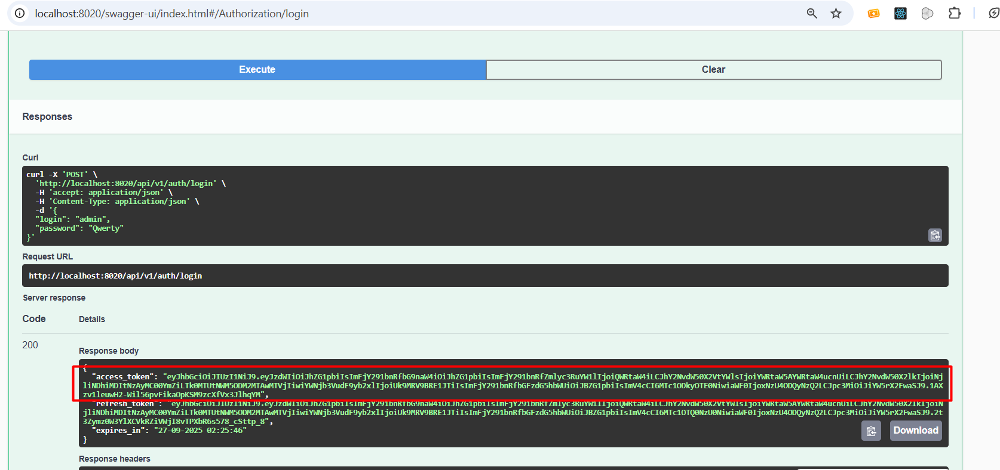
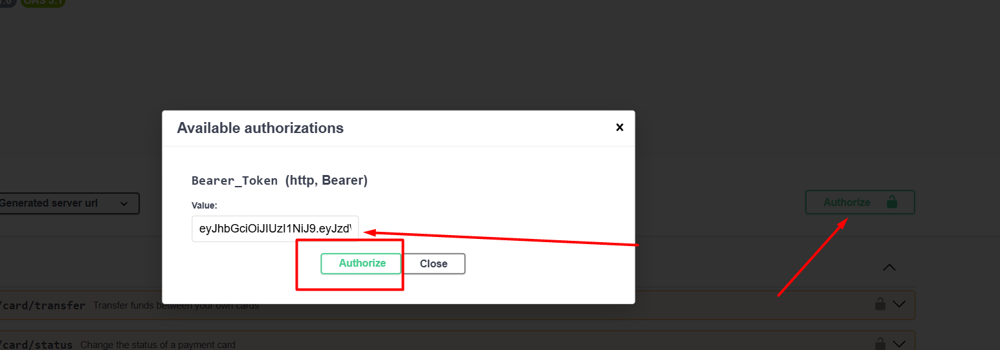

# Bank API

Простое RESTful API для управления банковскими счетами и платёжными картами.

## 📋 Общая информация

- **Версия:** 1.0
- **Базовый URL:** `http://localhost:8020`
- **OpenAPI:** 3.1.0
- **Лицензия:** [I sure we have license](https://our-license-url.com)
- **Контакт:** y.kosachou (<zanoza.by@gmail.com>)

---

## 🔐 Аутентификация

Для доступа к защищённым эндпоинтам используется **JWT Bearer Token**.  
Добавьте заголовок:

Authorization: Bearer <ваш_токен>


---
## 📂 Технологии
Java 21, Spring Boot, Spring Security, Spring Data JPA, PostgreSQL, Liquibase, Docker, JWT, Swagger (OpenAPI)

## 📂 Эндпоинты

### 🏦 Счета (Accounts)

#### ➕ Создание акаунта
- **POST** `/api/v1/account`  
  Создает новую учетную запись(создается аккаунт с ролью `USER`). Доступно для всех ролей и неавторизованных пользователей.

#### 🔄 Обновление аккаунта
- **PUT** `/api/v1/account`  
  Обновляет информацию существующего аккаунта. Доступно для авторизированных пользователей.

#### 🧑‍⚖️ Обновление роли пользователя
- **PUT** `/api/v1/account/role`  
  Устанавливает роль пользователя (`USER` или `ADMIN`). Доступно только для роли (`ADMIN`)

#### 📃 Получение списка аккаунтов
- **GET** `/api/v1/accounts`  
  Позволяет получить список аккаунтов с поддержкой поиска и пагинации. Доступно только для роли (`ADMIN`)

#### 🔍 Получение аккаунта по ID
- **GET** `/api/v1/account/{id}`  
  Возвращает информацию об аккаунте по ID. Доступно для авторизированных пользователей (Для роли `USER`- имеет доступ только к своему аккаунту)

#### ❌ Удаление аккаунта
- **DELETE** `/api/v1/account/{id}`  
  Удаляет аккаунт по ID. Доступно для авторизированных пользователей (Для роли `USER` - имеет права на удаление только своего аккаунта)

---

### 💳 Карты (Cards)

#### ➕ Создание новой карты
- **POST** `/api/v1/card/new`  
  Создаёт новую платёжную карту, связанную с банковским счётом. Доступно для авторизированных пользователей в роли `ADMIN`

#### 📄 Получение всех карт
- **GET** `/api/v1/cards`  
  Возвращает список карт с возможностью фильтрации по балансу и имени владельца, а также поддержкой сортировки и пагинации.
  Пользователи с ролью `ADMIN` могут просматривать все карты, для `USER` только зарегестрированные на аккаунт

#### 🔍 Получение карты по ID
- **GET** `/api/v1/card/{id}`  
  Пользователь с ролью `USER` может просматривать только свои карты.  
  Пользователь с ролью `ADMIN` — любые.

#### ❌ Удаление карты
- **DELETE** `/api/v1/card/{id}`  
  Удаляет карту по ID.  
  Доступно только для пользователей с ролью `ADMIN`.

#### 🔁 Перевод между картами
- **PUT** `/api/v1/card/transfer`  
  Перевод средств между двумя активными картами одного аккаунта.  
  Перед выполнением проверяется баланс, статус и владение картами. Доступен для всем авторизированным пользователям 

#### ⛔ Запрос на блокировку карты
- **PUT** `/api/v1/card/request/block`  
  Отправляет запрос на блокировку карты.  
  Используется при утере, краже или подозрении на мошенничество.

#### 🔄 Изменение статуса карты
- **PUT** `/api/v1/card/status`  
  Изменяет статус карты (`ACTIVE`, `BLOCKED`, `EXPIRED`).  
  Применяется при активации новой карты или при блокировке. Доступен для роли `ADMIN`

#### 💰 Пополнение баланса карты
- **PUT** `/api/v1/card/balance/increase`
- Пользователь с ролью `USER` может пополнять только свои карты.
- Пользователь с ролью `ADMIN` — любые карты.

---

### 🔐 Авторизация

#### 🔑 Вход в систему
- **POST** `/api/v1/auth/login`  
  Аутентификация пользователя и получение access/refresh токенов.
  Предустановленный пользователь с ролью `ADMIN` ```json { "login": "admin", "password": "Qwerty" } ```

#### 🔄 Обновление токена
- **POST** `/api/v1/auth/refresh`  
  Получение нового access токена с помощью refresh токена.

#### 🚪 Выход из системы
- **GET** `/api/v1/auth/logout`  
  Деактивация текущего токена.

### Дополнительные сервисы системы
Для обработки задач слежения за истечением срока действия карт и блокировки карт по запросу пользователя реализованы фоновые задачи.
- Задача блокировки карты по запросу срабатывает каждые 10 сек(cron :***"*/10 * * * * *"***)
- Задача по обработки истечения срока действия карт срабатывает 00:01 (cron :***"0 1 0 * * *"***)

###  🏁 Запуск приложения

1. Склонировать исходный код из ветки main:

```bash
git clone -b main https://github.com/YuraKosachev/Bank_api.git
```
2. Запустить все сервисы через Docker Compose:

```bash
docker-compose up -d --build
```

## 🚀 Развёрнутые сервисы

### 🐘 PostgreSQL
- Контейнер: ms_pg_sql
- Образ: postgres:17
- Порт: 5435:5432
- Пользователь: **effective_mobile_user**
- Пароль: **effective_mobile_password**

### 📊 pgAdmin
- Контейнер: ms_pgadmin
- Образ: dpage/pgadmin4
- Порт: 5050:80
- Email: **pgadmin@pgadmin.org** (по умолчанию)
- Пароль: **admin** (по умолчанию)

---

## 🧪 Этапы тестирования

1. Проверка успешного запуска всех контейнеров через `docker-compose ps`.
2. Переходим в Swagger UI: [`http://localhost:8020/swagger-ui/index.html`](http://localhost:8020/swagger-ui/index.html)
3. Вводим предустановленые креды для получения токена ([`логин ендпойнт`]( http://localhost:8020/swagger-ui/index.html#/Authorization/login))
   или создаем нового пользователя ([`создание аккаунта`](http://localhost:8020/swagger-ui/index.html#/Accounts/create)) и проделываем операцию по получению токена с ним.

4. Копируем access_token и авторизируемся в swagger.

5. Можно тестировать согласно ендпойнты согласно описанию доступности из описания пункта ***Эндпоинты***